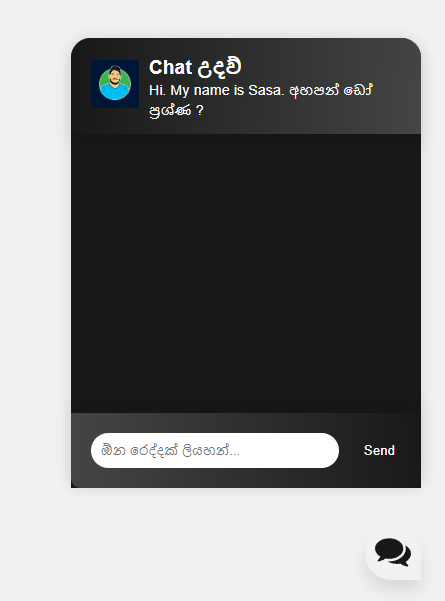
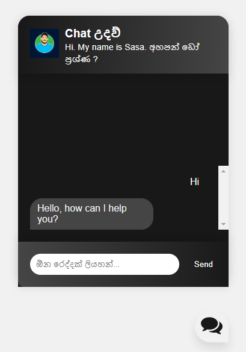

# Chatbot Web Application

This is a chatbot web application built using Flask, PyTorch, and NLTK. It provides a chat interface where users can interact with the chatbot to get responses based on the provided patterns and intents.




## Features

- Allows users to have a conversation with the chatbot.
- Provides responses based on the trained model and predefined intents.
- Handles user input and displays chat messages in real-time.

## Prerequisites

- Python 3.6 or higher
- Flask
- PyTorch
- NLTK
- TorchVision

## Getting Started

1. Clone the repository:

```bash
git clone https://github.com/sasankaweera123/website_chatbot.git
```

2. Install the required dependencies:

```pip install {package}```

3. Train the chatbot model:
    - Update the `intents.json` file with your own intents, patterns, and responses.
    - Run the `train_chatbot.py` script to train the model:

        ```python train_chatbot.py```

4. Run the web application:

```python app.py```

5. Open your browser and navigate to `http://localhost:5000` to access the chatbot interface.

## Usage

- Type your message in the input field and press Enter or click the Send button to send your message to the chatbot.
- The chat messages will be displayed in the chatbox.
- The chatbot will respond with an appropriate message based on the provided patterns and intents.

## Customization

- To customize the chatbot behavior, update the `intents.json` file with your own intents, patterns, and responses.
- You can modify the HTML template (`base.html`) and CSS styles (`style.css`) to change the appearance of the chatbox interface.

## License

[](https://opensource.org/licenses/Apache-2.0)

## Acknowledgments

- This project is based on the tutorial by patrickloeber on building a chatbot with PyTorch and Flask. Thank you for the helpful tutorial and code examples!
